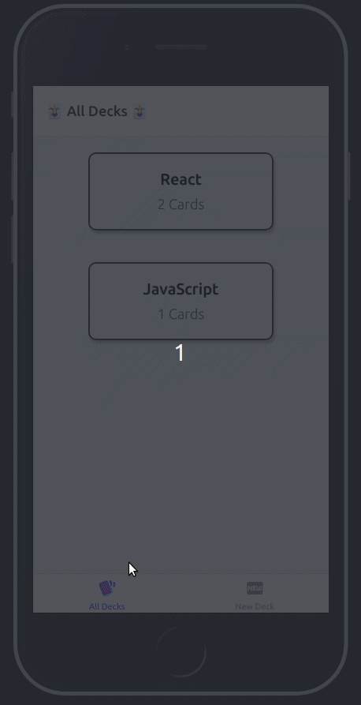

# Udacity Cards Project: Mobile Flashcards

_Final Project For React Nanodegree_

##### AIM:

- This web apps consist of card-decks.
- each deck consist of question cards.
- User can add cards, add decks, delete deck.
- User can move b/w various screens.
- User can take the quiz in a deck. and get a cscore corresponding to the performance.

## Platform tested on :-

- Web-Browser using expo start's(Run in web browser mode).
- How? See peek a boo!

### Peek a boo!



## How I Started

```
  $ expo init projectname
  $ choose blank template
  $ expo start or npm start
  $ scan the code and view on expo-app
```

## Launch Project

```
  yarn start
```

## Wanna Contribute?

```
yarn add global expo  or yarn add global create-react-native-app
git clone <repo_url>
yarn
expo start


```
